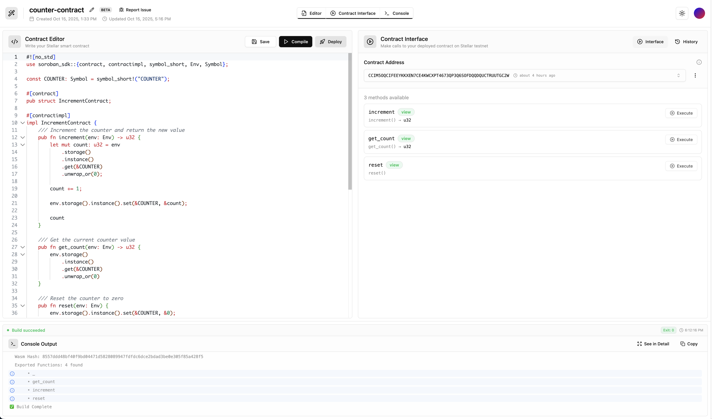

  <h1>
    Stellar Playground
  </h1>

  

    Write, compile, and deploy Soroban smart contracts using Rust directly in your browser.
  

  

    <a href="https://stellarplay.app">stellarplay.app</a>
  

   

  

## ✨ Features

Stellar Playground is a browser-based development environment that makes Soroban smart contract development simple and accessible.

- **Zero Setup Required** - Start building Soroban smart contracts instantly
- **Professional Editor** - Full Rust syntax highlighting with Soroban SDK integration
- **Instant Compilation** - Compile Rust to WASM using Stellar CLI in seconds
- **Built-in Deployment** - Deploy to Stellar testnet with Friendbot-funded wallet
- **Interactive Testing** - Test contracts through auto-generated interface
- **Code Sharing** - Share contracts via public links

## 💫 Stellar Playground vs Traditional Setup

| Feature | Traditional Setup | Stellar Playground |
|---------|-------------|---------|
| Initial Setup | 30+ minutes of installation & configuration | < 30 seconds - just open browser |
| Prerequisites | Rust toolchain, Stellar CLI, Node.js, VS Code | Modern web browser only |
| Development | Local machine setup with multiple tools | Fully browser-based IDE |
| Compilation | Local Stellar CLI setup and configuration | Instant cloud compilation |
| Deployment | Manual Stellar wallet & testnet configuration | One-click deployment with Friendbot-funded wallet |
| Testing | Local test environment setup | Instant contract spec generation & testing interface |
| Updates | Manual toolchain updates | Always up-to-date platform |
| Collaboration | Complex environment sharing | Instant contract sharing |

## LICENSE

Stellar Playground is licensed under the Business Source License 1.1. You can find the full license text in the [LICENSE.md](LICENSE.md) file.